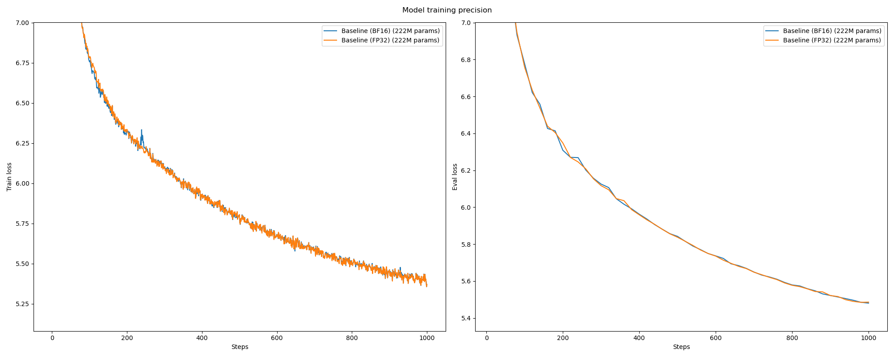
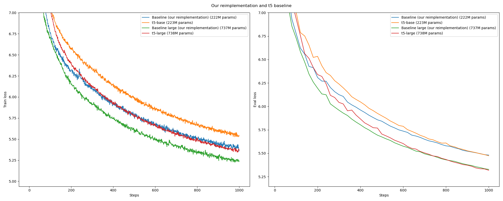
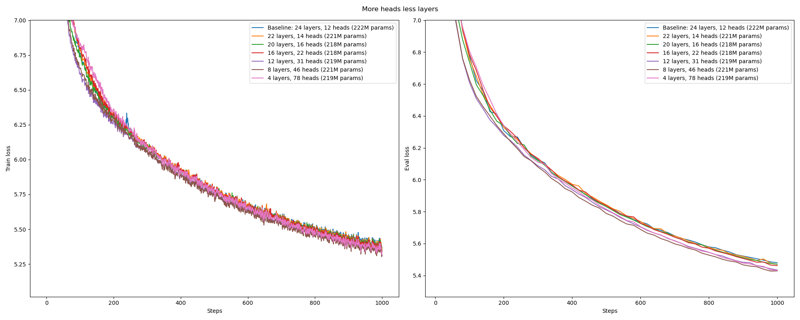
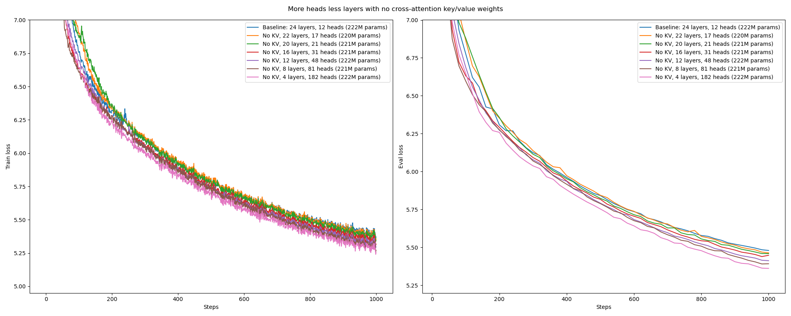
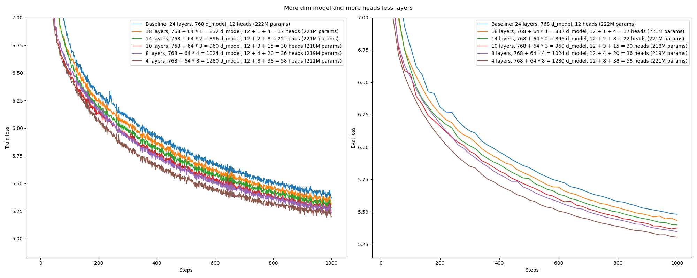
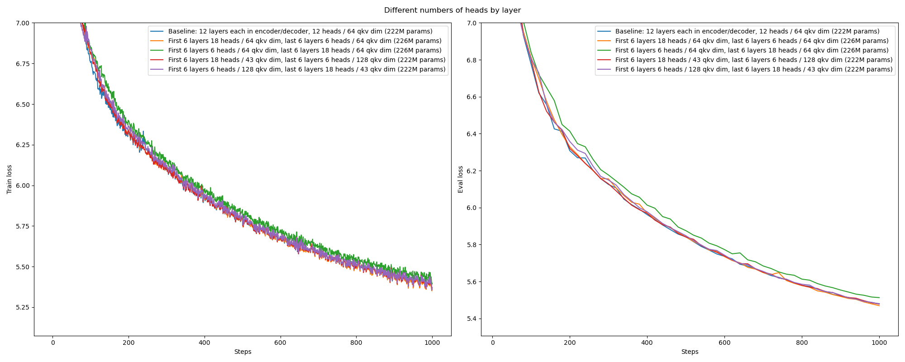
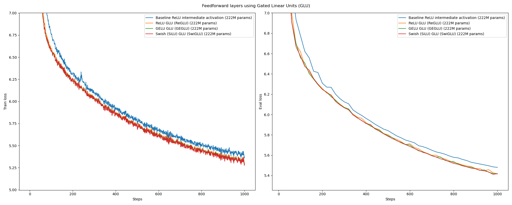
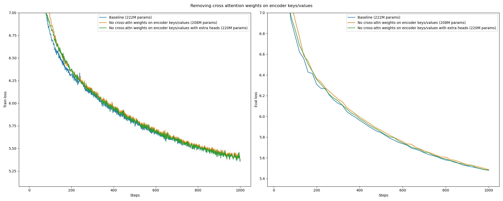
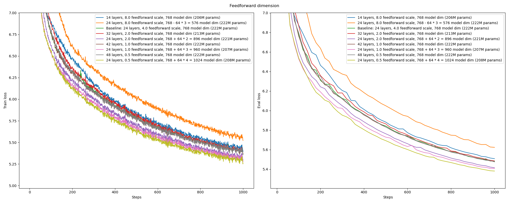

**M**odel **ARCH**itecture experiments

* toc
{:toc}

Research conducted under Prof. Kurt Keutzer at Berkeley Artificial Intelligence Research (BAIR). 


## Example setup
```bash
git clone https://github.com/bri25yu/march
cd march

conda env create --file environment.yml
conda activate march

deepspeed run.py
```

# Experimental Setup

<details>
<summary></summary>

All of the following experiments are over constant data budget, model parameters, and compute unless noted otherwise. The data budget is determined by the number of steps taken and the number of tokens per step, for a total number of tokens seen over training. The model parameters is determined by counting the total number of trainable parameters in a model prior to training. The compute is approximated by how long the run took. All experiments are run on an 8 GPU DGX node consisting of 8 NVIDIA A5000 GPUs.

We train models for 1000 steps, enough for the models to start learning and to make their behavior/performance differentiable from other models. Every step, the model sees 1M tokens. Every experiment sees 1000 steps * 1M tokens per step = 1B tokens. We use the [Wikipedia](https://huggingface.co/datasets/wikipedia) dataset.

The baseline model has around 220M parameters to match with [t5-base](https://huggingface.co/t5-base) and by default every subsequent model matches this budget. Specifically, the baseline model has an encoder-decoder architecture, absolute position embeddings for the position encoding, 12 layers each in the encoder and decoder (for 24 layers total), 768 model dimension, 64 query-key-value dimension (for an equivalent 12 attention heads), and 768 * 4 = 3072 feedforward dimension.

The models are optimized using AdamW using 90% old gradient in the gradient exponential moving average (EMA) and 95% old hessian approximiation in the hessian approximation EMA (equivalently 10% new gradient and 5% new hessian approx). We use a constant learning rate schedule and a learning rate value of 1e-4. 

The models are trained in BF16, with exceptions noted otherwise. 

</details>

<br>
<br>


# Results
## FP32 vs BF16 makes no difference

<details>
<summary></summary>



</details>

<br>
<hr>
<br>

## Our re-implementation is comparable to the T5 baseline

<details>
<summary></summary>



We compare our reimplementation with the implementation in [Raffel et al, Oct 2019](https://arxiv.org/abs/1910.10683).

Our re-implementation has two differences compared to the T5-base baseline:
1. We use absolute position embeddings while T5 uses relative attention position embeddings.
    - Our position encodings require more parameters. For a max sequence length of 1024 and a dim_model of 768, we need 1024 * 768 ~ 800k parameters. For a relative attention num buckets of 32 and num_heads of 12, T5 uses 32 * 12 ~ 400 parameters.
2. Our tokenizer is trained only on wikitext-103 which transfers tokenization benefits to the training wikipedia dataset. This results in more efficient representations per token for our model and more productive training.

The relative patterning of experiments stays the same when moving from the base exps 220M params to the large exps 740M params, very cool to see. 

Obviously as training continues, the t5 baseline will outmatch our implementation. We postulate that this difference is due to the difference in positional encoding. This is reflected in the fact that our model quickly overfits i.e. train loss < val loss very early on, while the t5 model does not over fit i.e. train loss > val loss. Critically, the train loss should be > val loss since dropout is applied during training. 

</details>

<br>
<hr>
<br>

## More heads less layers is better

<details>
<summary></summary>



</details>

<br>
<hr>
<br>

## More heads less layers with no cross-attention key/value weights is better

<details>
<summary></summary>



</details>

<br>
<hr>
<br>

## More model dimension less layers is better

<details>
<summary></summary>


</details>

<br>
<hr>
<br>

## More model dimension and more heads less layers is better

<details>
<summary></summary>



</details>

<br>
<hr>
<br>

## Number of heads per layer does not affect performance, only total heads does

<details>
<summary></summary>

The outlier is the situation where the first 6 layers in the encoder and decoder have much fewer heads than the last 6 layers. This may signal that there is a requirement for more granular attention in the initial layers. 



</details>

<br>
<hr>
<br>

## Gated Linear Units are better

<details>
<summary></summary>

This is a successful replication of [Shazeer et al, Feb 2020](https://arxiv.org/abs/2002.05202).



</details>

<br>
<hr>
<br>

## Cross-attention key/value weights on the encoder have no effect on performance

<details>
<summary></summary>



</details>

<br>
<hr>
<br>

## Less feedforward dimension, more model dim or more layers better

<details>
<summary></summary>



</details>

<br>
<hr>
<br>


# Ideas
Sequence length reduction idea, every attention layer has (N, L, D) input but outputs (N, L, D_\prime). How would attention residuals work? No residuals on self attention with a deep network is disastrous. Maybe add a no-op in the keys and values? Have a zero value vector and a some corresponding key vector. The key vector could be learned or fixed. Previous work has tried zero key and zero value, but this is incorrect for bias-less models. Also a little bit hard to imagine for models with bias since in the softmax the dot product is 0. Would also be a crazy speedup

Albert -- one big boy layer multiple times.

Encoder/decoder vs decoder-only paradigm. Would need a tad bit of dataset work for decoder-only, but it's just converting from text to tokens.

Bottlenecks -- force model summarization in not the L dim but the D dim. Could go from something like 768 to 384 to 192 layer by layer or even the inverse. 768 is a huge representation for a single token. Maybe have the scaled up dims the same i.e. attention is still the same 768 = 12 heads by 64 qkv dim but the intermediate dim is like 192 and feedforward is the same 192 to 768 * 4 and back down to 192. 

# Baseline V2

- [TODO] Relative position encoding - T5 and rotary
  - https://arxiv.org/abs/1803.02155
  - https://arxiv.org/abs/2009.13658
  - https://arxiv.org/abs/2104.09864
- GELU-GLU activation in FF
- Round both embedding and FF layers to multiple of 64
- No key/value cross attention map
