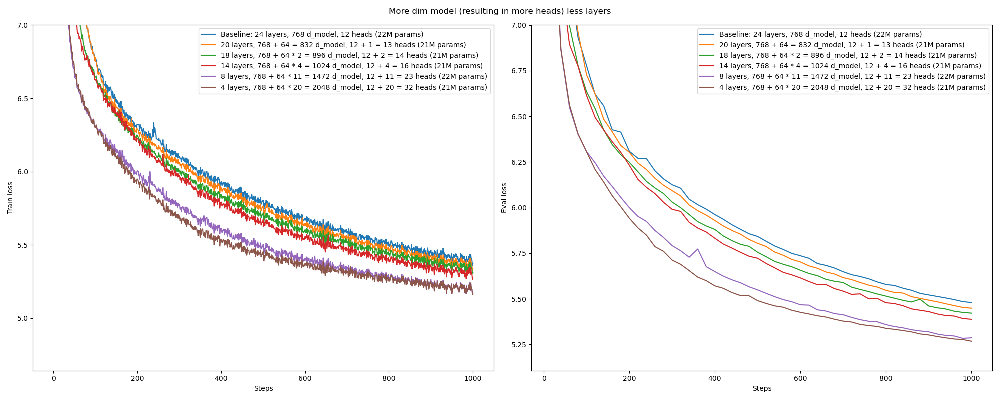

**M**odel **ARCH**itecture experiments

* toc
{:toc}

Research conducted under Prof. Kurt Keutzer at Berkeley Artificial Intelligence Research (BAIR). 


## Example setup
```bash
git clone https://github.com/bri25yu/march
cd march

conda env create --file environment.yml
conda activate march

# For apex see https://github.com/NVIDIA/apex
cd ..
git clone https://github.com/NVIDIA/apex
cd apex
pip install -v --disable-pip-version-check --no-cache-dir --global-option="--cpp_ext" --global-option="--cuda_ext" ./
cd ../march

deepspeed run.py
```

# Experimental Setup

<details>
<summary></summary>

All of the following experiments are over constant data budget, model parameters, and compute unless noted otherwise. The data budget is determined by the number of steps taken and the number of tokens per step, for a total number of tokens seen over training. The number of model parameters is determined by counting the total number of trainable parameters in a model prior to training. The compute is approximated by how long the run took. All experiments are run on a single node consisting of 8 NVIDIA A5000 GPUs.

We train models for 1000 steps, enough for the models to start learning and to make their behavior/performance differentiable from other models. Every step, the model sees 1M tokens. Every experiment sees 1000 steps * 1M tokens per step = 1B tokens. We use the [Wikipedia](https://huggingface.co/datasets/wikipedia) dataset.

The baseline model has 220M parameters to match with [t5-base](https://huggingface.co/t5-base) and by default every subsequent model matches this budget. Specifically, the baseline model has an encoder-decoder architecture, absolute position embeddings for the position encoding, 12 layers each in the encoder and decoder (for 24 layers total), 768 model dimension, 64 query-key-value dimension (for an equivalent 12 attention heads), and 768 * 4 = 3072 feedforward dimension.

The models are optimized using AdamW using 90% old gradient in the gradient exponential moving average (EMA) and 95% old hessian approximiation in the hessian approximation EMA (equivalently 10% new gradient and 5% new hessian approx). We use a constant learning rate schedule and a learning rate value of 1e-4. 

The models are trained in BF16. 

We follow the scaling law fitting approach of Kaplan et al, 2020 (https://arxiv.org/pdf/2001.08361.pdf). 

</details>

<br>


# Results
## Our re-implementation is comparable to the T5 baseline

<details>
<summary></summary>

<iframe style="width: 100%; height: 500px; resize: vertical; overflow: auto;" src="readme_resources/baseline_t5.pdf"></iframe>

We compare our reimplementation with the implementation in [Raffel et al, Oct 2019](https://arxiv.org/abs/1910.10683).

</details>

<br>
<hr>
<br>

## Gated Linear Units are better

<details>
<summary></summary>

This is a successful replication of [Shazeer et al, Feb 2020](https://arxiv.org/abs/2002.05202).

<iframe style="width: 100%; height: 500px; resize: vertical; overflow: auto;" src="readme_resources/gated_linear_units.pdf"></iframe>

</details>

<br>
<hr>
<br>

## More model dimension less layers is better

<details>
<summary></summary>



</details>

<br>
<hr>
<br>


# Working in a branch
First, modify the `name` parameter in the `environment.yml` file. 
```bash
git checkout /my/branch/path
conda env create --file environment.yml --prefix /path/to/new/conda
conda activate /path/to/new/conda
```
